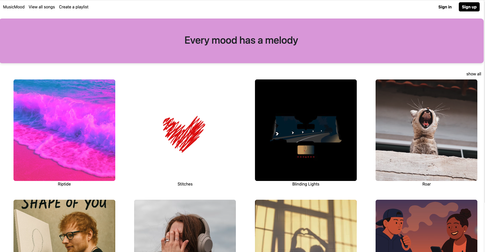
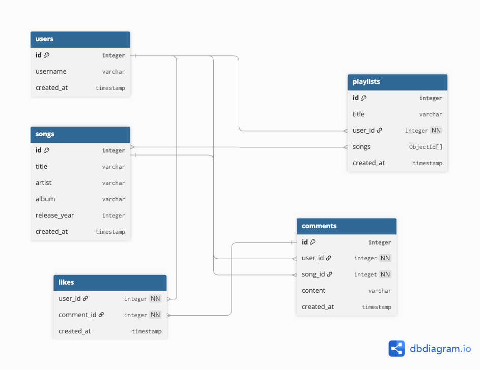
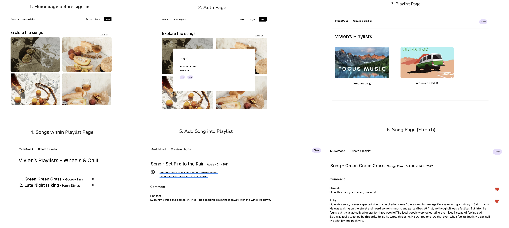
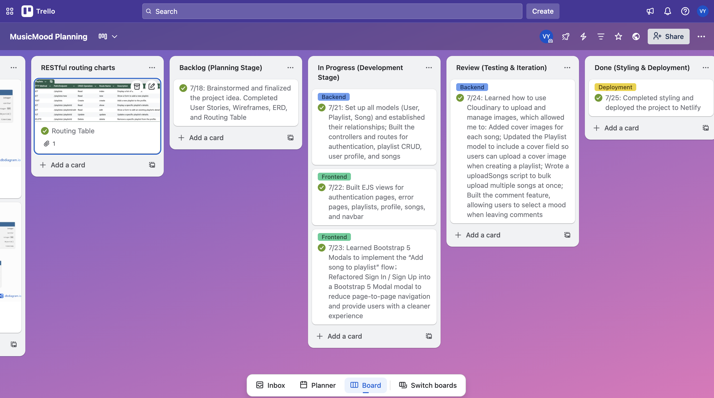

# MusicMood

Description: MusicMood is a full-stack music playlist web app built with Express, MongoDB, and EJS. This project focuses on building a full-stack CRUD application with authentication, user-generated content, and relational data between users, playlists, and songs. Its design goal is to create an immersive space where users can share their emotional experiences and feelings about the music they love.

Even without streaming music, MusicMood offers an engaging experience:

- Browse without signing in - Visitors can explore a limited set of songs on the homepage.

- Sign up / Log in – Gain full access to create a personal account.

- Create & manage playlists – Add songs to your playlists and organize your music.

- Mood-based commenting – Leave comments on songs and choose a mood to express how the song makes you feel.

- Social features – View other users’ profiles, explore their playlists, and see the moods of their latest comments.

- If an unregistered user tries to view all songs or create a playlist, a “Sign in to continue” message will appear.



## Deployment link

https://mymusicmood.netlify.app/

## Getting Started / Code Installation

Follow these steps to run the project locally:

1. Clone the repository

   `git clone https://github.com/bihuiy/MusicMood.git`

   `cd MusicMood`

2. Install dependencies `npm install`

3. Set up environment variables

   Create a .env file in the root directory and add the following variables:

   `MONGODB_URI=your-mongogb-uri`

   `SESSION_SECRET=your-session-secret`

   `CLOUDINARY_CLOUD_NAME=your-cloudinary-cloud-name`

   `CLOUDINARY_API_KEY=your-cloudinary-api-key`

   `CLOUDINARY_API_SECRET=your-cloudinary-api-secret`

4. Start the development server `npm run dev`

Open http://localhost:3000 (or the port shown in your terminal) to view the app in your browser.

## Timeframe & Working Team (Solo/Pair/Group)

This project was completed individually over one week, from 18th July to 25th July 2025.

## Technologies Used

**Frontend:** HTML5, CSS3, JavaScript

**Backend:** Node.js, Express

**Database:** MongoDB, Mongoose

**Architecture:** MVC (Model–View–Controller)

**Templating Engine:** EJS

**Authentication:** Express-Session, bcrypt

**Version Control & Deployment:** Git, GitHub

## Brief

The app utilizes EJS Templates for rendering views to users.
The app uses session-based authentication.
The app has at least one data entity in addition to the User model. At least one entity must have a relationship with the User model.
The app has full CRUD functionality.
Authorization is implemented in the app. Guest users (those not signed in) should not be able to create, update, or delete data in the application or access functionality allowing those actions.
The app is deployed online so that the rest of the world can use it.

## Planning

### 1. User Stories

> As a user, I want to visit the homepage without logging in so that I can understand what this app is about before deciding to sign up.
>
> As a user, I want to browse a few songs without logging in so that I can preview the app’s features.
>
> As a user, I want to easily sign up and log in so that I can access personalized features.
>
> As a user, I want to log out to protect my account when I'm done using the platform.
>
> As a logged-in user, I want to create multiple playlists so that I can group my favorite songs by mood or theme.
>
> As a logged-in user, I want to give each playlist a name so that I can recognize them easily.
>
> Stretch - As a logged-in user, I want to upload a custom cover image for each playlist, and if I don’t upload one, I want the app to assign a default image.
>
> As a user, I want to view all my playlists on my profile page.
>
> As a user, I want to delete my playlists when I no longer need them.
>
> As a logged-in user, I want to view other users’ profiles and see their playlists.
>
> I should not be able to edit or delete anyone else’s playlists.
>
> As a logged-in user, I want to click on one of my playlists and see all songs inside it.
>
> As a logged-in user, I want to delete a song from my own playlist.
>
> As a logged-in user, I want to view other users' playlists and see their songs, but I should not be able to remove their songs.
>
> As a user, I want to click into a song to view its detail page.
>
> Stretch - As a user, I want to see all public comments for that song.
>
> Stretch - As a logged-in user, I want to add my own comment on the song.
>
> Stretch - As a logged-in user, I want to delete my own comment if I change my mind.
>
> Stretch - I should not be able to delete other users’ comments.
>
> Stretch - As a user, I want to give likes to other users’ comments to express appreciation.

### 2. ERD (Entity-Relationship Diagram)

I designed the database schema early on, identifying the key entities (users, playlists, songs, comments(stretch), likes(stretch)) and their relationships.



### 3. Routing Table

| Route                         | Method | CRUD Operation | Description                                        |
| ----------------------------- | ------ | -------------- | -------------------------------------------------- |
| `/playlists`                  | GET    | Read           | Display a list of all playlists                    |
| `/playlists/new`              | GET    | Read           | Show a form to add a new playlist                  |
| `/playlists`                  | POST   | Create         | Add a new playlist to the profile                  |
| `/playlists/:playlistId`      | GET    | Read           | Display a playlist's details                       |
| `/playlists/:playlistId/edit` | GET    | Read           | Show a form to edit an existing playlist's details |
| `/playlists/:playlistId`      | PUT    | Update         | Update a playlist's details                        |
| `/playlists/:playlistId`      | DELETE | Delete         | Remove a playlist from the profile                 |

### 4. Wireframes



### 5. Trello Board

I used **Trello** to track my daily tasks and manage the overall progress of this project.

Below is a screenshot of my Trello board, which includes columns for **To Do**, **In Progress**, **Review**, and **Done**.



> A detailed day-by-day breakdown of the development process can be found in the **Build/Code Process** section below.

## Build / Code Process

Below is my detailed day-by-day breakdown of the development process.

### Backlog (Planning Stage)

- 7/18: Brainstormed and finalized the project idea. Completed **User Stories**, **Wireframes**, **ERD**, and **Routing Table**

### In Progress (Development Stage)

- 7/21:

  - Set up all models (User, Playlist, Song) and established their relationships <sup>[code snippet 1: Playlist Model with Relationships]</sup>
  - Built the controllers and routes for authentication, playlist CRUD, user profile, and songs

- 7/22: Built EJS views for authentication pages, error pages, playlists, profile, songs, and navbar
- 7/23:
  - Learned Bootstrap 5 Modals to implement the “Add song to playlist” flow
  - Refactored Sign In / Sign Up into a Bootstrap 5 Modal modal to reduce page-to-page navigation and provide users with a cleaner experience

### Review (Testing & Iteration)

- 7/24:
  - Learned how to use Cloudinary to upload and manage images, which allowed me to:
    - Added cover images for each song
    - Updated the Playlist model to include a cover field so users can upload a cover image when creating a playlist
  - Wrote a uploadSongs script to bulk upload multiple songs at once <sup>[code snippet 2: Bulk Upload Songs Script]</sup>
  - Built the comment feature, allowing users to select a mood when leaving comments, and displays a personalized message on their profile based on their most recent mood <sup>[code snippet 3: Displaying User Mood on Profile Page]</sup>

### Done (Styling & Deployment)

- 7/25: Completed styling and deployed the project to Netlify

### Code Snippets

1. Playlist Model with Relationships:

**Goal:** Create a playlist model that links each playlist to its owner (a user) and contains an array of songs.

After creating the User and Song models, I wanted playlists to belong to a user and store multiple songs. To achieve this, I used Mongoose's ObjectId references to establish relationships between collections:

```js
import mongoose from "mongoose";

// define a playlist schema
const playlistSchema = new mongoose.Schema({
  name: { type: String, required: true },
  owner: { type: mongoose.Schema.Types.ObjectId, ref: "User" },
  songs: [{ type: mongoose.Schema.Types.ObjectId, ref: "Song" }],
  playlistImage: { type: String },
});

// compile the schema into a model/function
const Playlist = mongoose.model("Playlist", playlistSchema);

export default Playlist;
```

2. Bulk Upload Songs Script

**Goal:** Since users are not allowed to upload, edit, or delete songs, I decided not to create CRUD routes for songs.

Instead, I planned to use a script to bulk upload multiple songs into the database at once. This keeps the app’s song list consistent and prevents unauthorized changes from users.

```js
// 1. connect database
import mongoose from "mongoose";
import dotenv from "dotenv";
import Song from "../models/song.js";

dotenv.config();

// 2. Songs to be uploaded into the database
const seedSongs = [
  {
    title: "Riptide",
    artist: "Vance Joy",
    album: "Dream Your Life Away",
    releaseYear: 2014,
    songImage:
      "https://res.cloudinary.com/dnycwkg4c/image/upload/v1753337227/Riptide_sdz6eh.webp",
  },
  {
    title: "Stitches",
    artist: "Shawn Mendes",
    album: "Handwritten",
    releaseYear: 2015,
    songImage:
      "https://res.cloudinary.com/dnycwkg4c/image/upload/v1753338736/Stitches_ngdf7r.avif",
  },
];

// 3. Upload the songs
async function uploadSongs() {
  try {
    await mongoose.connect(process.env.MONGODB_URI);
    await Song.deleteMany({}); // delete the previous data
    await Song.insertMany(seedSongs);
    console.log("Songs uploaded!");
  } catch (error) {
    console.error("Upload failed", error);
  } finally {
    // action the finally statement no matter songs succeed or failed
    await mongoose.disconnect(); // 4. Disconnect the connection to database
  }
}

uploadSongs();
```

3. Displaying User Mood on Profile Page

**Goal:** After building the comment feature and allowing users to select a mood when leaving comments, I wanted to make the user profile page feel more personalized.

I designed the profile page to fetch the user’s most recent comment, extract the selected mood, and display a matching message to reflect their current vibe.

```js
// get the user's mood from the latest comment
const lastComment = await Comment.findOne({ user: playlistOwnerId })
  .sort({ createdAt: -1 })
  .select("mood")
  .exec();

const mood = lastComment ? lastComment.mood : "None";

let message;
if (mood === "Happy") {
  message = "Keep enjoying your happy life!";
} else if (mood === "Sad") {
  message = "Feeling down? We're here for you.";
} else if (mood === "Nostalgic") {
  message = "Music brings memories to life!";
} else if (mood === "Fun Fact") {
  message = "Thanks for sharing the fun insight!";
} else if (mood === "Chill") {
  message = "Stay relaxed and vibe on.";
} else if (mood === "Romantic") {
  message = "Love is in the air—and in the music.";
} else if (mood === "Energetic") {
  message = "Your energy is contagious! Keep the beat going!";
} else if (mood === "Lonely") {
  message = "Feeling alone? Music connects us all.";
} else {
  message = "Share your mood through music!";
}
```

## Challenges

One of the main challenges I faced was implementing a feature that allows users to add a song to one of their playlists. I needed a way to display all of a user’s playlists dynamically and let them choose which one to add the song to, without navigating away from the song page. To solve this, I learned how to use Bootstrap 5 Modals to create a popup interface. I placed a form with a `select` listing all playlists inside the modal, so users could choose and submit directly.

```html
<!-- Add song to a playlist modal -->
<!-- Button trigger modal -->
<button
  type="button"
  class="btn btn-primary"
  data-bs-toggle="modal"
  data-bs-target="#addSongModal"
>
  Add to my playlist
</button>

<!-- Modal -->
<div
  class="modal fade"
  id="addSongModal"
  tabindex="-1"
  aria-labelledby="addSongModalLabel"
  aria-hidden="true"
>
  <div class="modal-dialog">
    <div class="modal-content">
      <div class="modal-header">
        <h1 class="modal-title fs-5" id="addSongModalLabel">
          Choose a playlist
        </h1>
        <button
          type="button"
          class="btn-close"
          data-bs-dismiss="modal"
        ></button>
      </div>
      <div class="modal-body">
        <form action="/songs/<%= song._id %>/add-to-playlist" method="POST">
          <select name="playlistId">
            <% playlists.forEach(playlist => { %>
            <option value="<%= playlist._id %>"><%= playlist.name %></option>
            <% }) %>
          </select>
          <button type="submit">Add Song</button>
        </form>
      </div>
    </div>
  </div>
</div>
```

Once I realized how effective modals were, I decided to refactor the Sign In and Sign Up pages into modals as well. This reduced unnecessary page transitions, making the user experience cleaner and more seamless while maintaining all form functionality.

```html
<!-- Sign up modal -->
<div class="modal-dialog modal-dialog-centered">
    <div class="modal-content">
      <div class="modal-header">
        <h1 class="modal-title fs-5" id="signUpModalLabel">
          Create a new account!
        </h1>
        <button
          type="button"
          class="btn-close"
          data-bs-dismiss="modal"
          aria-label="Close"
        ></button>
      </div>
      <div class="modal-body">
        <form class="auth-form" action="/auth/sign-up" method="POST">
          <label for="username">Username:</label>
          <input type="text" name="username" id="username" required />
          <label for="password">Password:</label>
          <input type="password" name="password" id="password" required />
          <label for="confirmPassword">Confirm Password:</label>
          <input
            type="password"
            name="confirmPassword"
            id="confirmPassword"
            required
          />
      </div>
      <div class="modal-footer">
        <button type="submit" class="btn btn-primary">Sign up</button>
        <button type="button" class="btn btn-secondary" data-bs-dismiss="modal">
          Close
        </button>
      </div>
    </form>
    </div>
  </div>
```

## Wins

One feature I’m particularly proud of is implementing redirect after sign up / sign in to improve the user experience.

I wanted users to be able to click any protected URL (such as a song detail page) even before signing in. If they were not signed in, they would see a message prompting them to sign in, and once successfully signed in, they would be redirected back to the exact page they originally intended to visit — without having to manually navigate back.

To achieve this, I stored the user’s intended destination using Express sessions. Here’s the middleware I built:

```js
const isSignedIn = (req, res, next) => {
  if (req.session.user) return next();
  else {
    req.session.message = "Please sign in to continue.";
    req.session.redirectTo = req.originalUrl;
    return res.redirect("/");
  }
};

export default isSignedIn;
```

And in my sign-in route, I handled the redirect logic like this:

```js
req.session.user = {
  _id: existingUser._id,
  username: existingUser.username,
};
req.session.message = "You are now signed in. Enjoy MusicMood!";

const redirectUrl = req.session.redirectTo || "/";
req.session.redirectTo = null;

req.session.save(() => {
  return res.redirect(redirectUrl); // Redirect to the home page "/" or origin url
});
```

## Key Learnings / Takeaways

This was my second project at GA, but my first full CRUD application, which was a huge milestone for me.

One of my biggest learnings was how to design and structure routes thoughtfully. Beyond the basic RESTful routes, I faced an interesting challenge when deciding how to implement:

- Adding a song to a playlist, I designed this as:

```js
POST /songs/:songId/add-to-playlist
```

and handled the `playlistId` in `req.body`. My reasoning was thatthe user would be on a song’s detail page and would select which playlist to add the song to.

- Removing a song from a playlist, I designed this as:

```js
DELETE /playlists/:playlistId/remove-song
```

and handled the `songId` in `req.body`. In this case, I assumed the user would already be on a specific playlist page when clicking "remove," so the playlistId could be part of the URL while the song could be passed in the body.

This decision-making process was surprisingly tricky. I didn’t anticipate feeling confused about route design until I started implementing it. It turned out to be a valuable learning experience that helped me better understand RESTful design principles and how to build routes that make sense from a user’s perspective.
